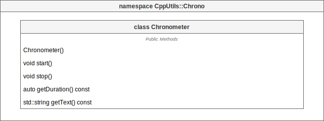

# [CppUtils](../README.md) / Chrono

[](../README.md)

## Chronometer

The ``Chronometer`` class allows to measure an elapsed time. The ``Chronometer{}`` constructor starts the chronometer automatically.

<p align="center"></p>

### Example
```cpp
#include <CppUtils.hpp>

int main()
{
	using namespace std::chrono_literals;
	
	auto chrono = CppUtils::Chrono::Chronometer{};
	std::this_thread::sleep_for(5s);
	chrono.stop();
	std::cout << "Duration: " << chrono.getText() << std::endl;

	return 0;
}
```

---
