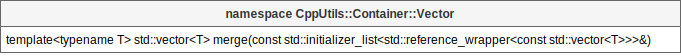

# [CppUtils](../README.md) / Container

[](../README.md)

## Vector

The ``merge({a, b, c})`` function returns the merged result of the vectors a, b and c.

<p align="center"></p>

### Example
```cpp
#include <CppUtils.hpp>

int main()
{
	const auto vector1 = std::vector<int>{ 1, 2, 3 };
	const auto vector2 = std::vector<int>{ 4, 5, 6 };
	const auto vector3 = CppUtils::Container::Vector::merge({ vector1, vector2 });
	
	for (const auto nb : vector3)
		std::cout << nb << '\n';
	
	return 0;
}
```

---
