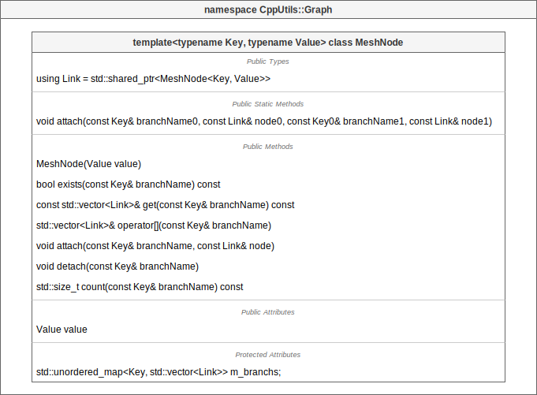
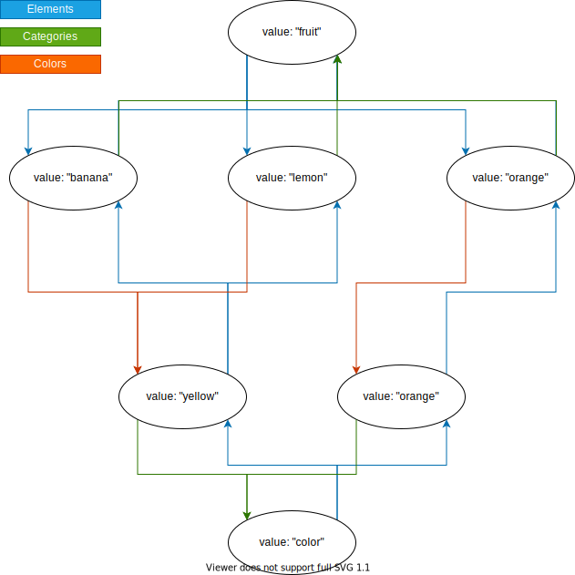
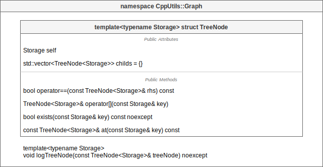
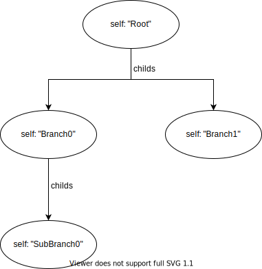

# [CppUtils](../README.md) / Graph

[](../README.md)

## MeshNode

The ``MeshNode`` class is a container allowing to make [mesh networks](https://en.wikipedia.org/wiki/Mesh_networking).

Each ``MeshNode`` instance can be connected to the others by creating branches.
Each branch has a name and can point to one or more nodes.

It is possible to attach and detach nodes, and to count the number of nodes per branch.

The branches are unidirectional. The static method ``attach(branchName0, node0, branchName1, node1)`` allows to make bidirectional links.

Nodes storage is managed by a ``std::shared_ptr<MeshNode<Key, Value>>`` (simplified by the ``Link`` type) which allows memory unallocation for nodes that lose any link with the network.

<p align="center"></p>

### Example
```cpp
#include <CppUtils.hpp>

int main()
{
	using StringMeshNode = CppUtils::Container::MeshNode<std::string, std::string>;
	auto fruit = std::make_shared<StringMeshNode>("fruit");
	auto banana = std::make_shared<StringMeshNode>("banana");
	auto lemon = std::make_shared<StringMeshNode>("lemon");
	auto color = std::make_shared<StringMeshNode>("color");
	auto yellow = std::make_shared<StringMeshNode>("yellow");
	auto orangeFruit = std::make_shared<StringMeshNode>("orange");
	auto orangeColor = std::make_shared<StringMeshNode>("orange");

	StringMeshNode::attach("Colors", yellow, "Elements", banana);
	StringMeshNode::attach("Colors", yellow, "Elements", lemon);
	StringMeshNode::attach("Colors", orangeColor, "Elements", orangeFruit);
	StringMeshNode::attach("Categories", color, "Elements", yellow);
	StringMeshNode::attach("Categories", fruit, "Elements", banana);
	StringMeshNode::attach("Categories", fruit, "Elements", lemon);
	StringMeshNode::attach("Categories", color, "Elements", orangeColor);
	StringMeshNode::attach("Categories", fruit, "Elements", orangeFruit);

	for (const auto& aFruit : fruit->get("Elements"))
	{
		const auto& fruitName = aFruit->value;
		const auto& fruitColor = aFruit->get("Colors")[0]->value;
		const auto& fruitCategory = aFruit->get("Categories")[0]->value;

		std::cout << fruitName << " is a " << fruitColor << " " << fruitCategory << std::endl;
	}

	return 0;
}
```

<p align="center"></p>

Result:
```
banana is a yellow fruit
lemon is a yellow fruit
orange is a orange fruit
```

---

## TreeNode

The ``TreeNode`` structure is a container allowing to make [tree (data structure)](https://en.wikipedia.org/wiki/Tree_(data_structure)).

Each ``TreeNode`` instance has the value it stores (``Storage``) and child nodes in a ``std::vector<TreeNode<Storage>>``.

The function ``logTreeNode(treeNode)`` allows to display the tree in text format in the terminal.
For this, the Storage type must have a ``std::ostream& operator<<(std::ostream&)`` operator.

<p align="center"></p>

### Example
```cpp
#include <CppUtils.hpp>

int main()
{
	using StringTreeNode = CppUtils::Container::TreeNode<std::string>;
			
	auto root = StringTreeNode{"Root"};
	root.childs.emplace_back(StringTreeNode{"Branch0"});
	root.childs.emplace_back(StringTreeNode{"Branch1"});
	branch0.childs[0].childs.emplace_back(StringTreeNode{"SubBranch0"});

	CppUtils::Terminal::setConsoleOutputUTF8();
	CppUtils::Log::TreeNodeLogger::log(root);
	return 0;
}
```

<p align="center"></p>

Result:
```
 Root
 ├─ Branch0
 │  └─ SubBranch0
 └─ Branch1
```

---
