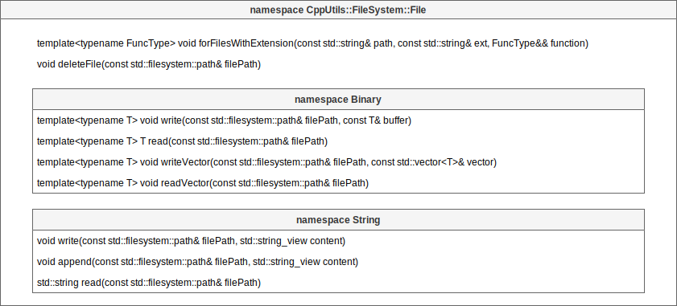

# [CppUtils](../README.md) / FileSystem

## File

The following functions allow you to manipulate files.

The function ``forFileWithExtension(path, ext, function)`` allows to execute a function for each file with the expected extension in the specified folder.

The namespaces ``Binary`` and ``String`` allow respectively to manipulate binary and text files.

Functions ``writeVector(filePath, vector)`` and ``readVector(filePath)`` allow to write and read ``std::vector<T>`` in a file. These functions copy directly in binary the values stored in the ``std::vector<T>``.

---
