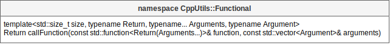

# [CppUtils](../README.md) / Functional

[](../README.md)

## Function

The function ``callFunction(function, arguments)`` allows you to call a function by passing its arguments in the form of a ``std::vector<Argument>``.
However, the arguments must all be of the same type.

<p align="center"></p>

### Example
```cpp
#include <CppUtils.hpp>

int main()
{
	const auto sum = std::function<int(int, int, int)>{[](int a, int b, int c) {
		return a + b + c;
	}};
	const auto vec = std::vector<int>{10, 15, 17};
	
	std::cout << CppUtils::Functional::callFunction<3>(sum, vec) << std::endl;

	return 0;
}
```

---
