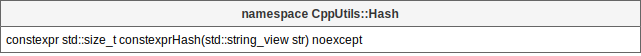

# [CppUtils](../README.md) / Hash

[](../README.md)

The ``hash(string)`` function allows to hash a string during compilation.
The hash allows to obtain an identifier from the string filled in.

<p align="center"></p>

### Example
```cpp
#include <CppUtils.hpp>

int main()
{
	const auto id = CppUtils::Hash::hash("Text");

	std::cout << id << std::endl;

	return 0;
}
```

---
