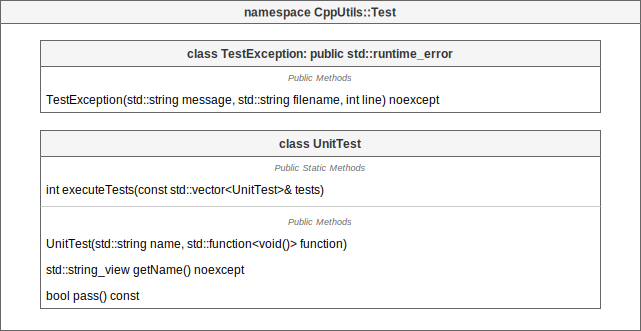

# [CppUtils](../../README.md) / [Language](../README.md) / Compiler

[](../README.md)

## UnitTest

Unit tests are used to test different components of a project in order to verify the proper functioning of a specific part of a program.

The ``UnitTest`` class is used to create unit tests. Its static function ``executeTests(tests)`` allows to execute a set of tests.
The function returns an error code if they have failed.
Executing unit tests writes logs to the terminal. You can add your own logs in each test.

<p align="center"></p>

The macro ``ASSERT(condition);`` can be called in unit tests to make them fail if the condition is false.
It throws a TestException caught by the unit test.

### Example
```cpp
#include <CppUtils.hpp>

int main()
{
	const auto tests = std::vector<CppUtils::Test>{

		CppUtils::Test{"UnitTest 1", [] {
			ASSERT("azerty" != "qwerty");
		}},

		CppUtils::Test{"UnitTest 2", [] {
			ASSERT("azerty" == "qwerty");
		}}

	};

	return CppUtils::Test::executeTests(tests);
}
```

---
