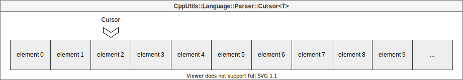
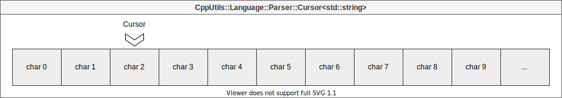

# [CppUtils](../../README.md) / [Language](../README.md) / Parser

[](../README.md)

## Cursor

The ``Cursor<T>`` structure allows you to place a cursor in a list of items to browse it.
It contains a non-owner pointer to the list of items and the position of the cursor in this list.
The structure provides some basic methods to facilitate the parsing of elements in this list.

<p align="center"> diagram"/></p>

The override ``Cursor<std::string>`` allows to create a cursor to browse a string.
This overload offers many more parsing methods.

<p align="center"> diagram"/></p>

---

## Context

In order to standardize parsing functions, the ``Context`` structure contains all the information required by a parsing function to analyze an expression.
This structure contains a ``Cursor`` and the parent node in the [AST](https://en.wikipedia.org/wiki/Abstract_syntax_tree).

Parsing functions must respect the signature ``bool(Context<Types...>&)``. They return a boolean value that informs if the searched item has been found or not.
``ParsingFunction`` is an alias for this function signature.

---

## Parsers

Various parsing functions allow you to read specific formats of information, such as quotes, numbers or words.
Parsing functions must respect the signature ``ParsingFunction``, as seen above.

### Example
```cpp
#include <CppUtils.hpp>

int main()
{
	using namespace std::literals;
	using namespace CppUtils::Type::Literals;

	const auto src = "\"Text\""sv;
	auto pos = std::size_t{0};
	auto cursor = CppUtils::Language::Parser::Cursor{src, pos};
	auto rootNode = CppUtils::Graph::VariantTreeNode<CppUtils::Type::Token>{"Root"_token};
	auto context = Parser::Context<Types...>{
		cursor,
		rootNode
	};

	if (!doubleQuoteParser(context))
		throw std::runtime_error{"Quotes not found"};
	
	CppUtils::Terminal::setConsoleOutputUTF8();
	CppUtils::Graph::logTreeNode(root);
	
	return 0;
}
```

Result:
```
 Root
 └─ Text
```

---

## Expression

The ``Expression``s are useful elements in the construction of a grammar. They are used to describe the syntax of a language to automate the parsing process.

Each ``Expression`` describes a lexical entity, itself made up of a series of lexical entities.
The lexical entities are called ``Lexeme``. They can be of various types (string, parsing function, another expression, etc).

Sometimes we want a lexeme to appear several times in a row, vary from one type to another, or be optional.  For example, when analyzing a language, we do not know in advance the number of instructions to read. This number is indeterminate. It is the same for the type of instruction. The lexeme types ``Recurrence`` and ``Alternative`` satisfy this need.

Each ``Expression`` is named by a ``Token``.
To define that an ``Expression`` is made up of another ``Expression``, we use the ``Token`` of the latter to call it in the parent ``Expression``.

The different types of ``Lexeme``s are:

- ``StringLexeme`` defines a lexeme as a string.

- ``ParserLexeme`` defines a lexeme based on a parsing function.

- ``TokenLexeme`` defines a lexeme as an expression (named by its ``Token``)

- ``TagLexeme`` defines a lexeme based on a parsing function, but unlike ``ParserLexeme``, the parsed string becomes the parent node (in the [AST](https://en.wikipedia.org/wiki/Abstract_syntax_tree)) of the next elements of the ``Expression``.

- ``RecurrentLexeme`` defines a lexeme as a repetition of an ``Expression`` (named by its ``Token``).\
Depending on the desired number of repetitions, a recurrence type can be defined with the following values: ``Optional``, ``EqualTo``, ``MoreThan`` or ``MoreOrEqualTo``, followed by the number of repetitions.

- ``AlternativeLexeme`` defines a lexeme as varying from one ``Expression`` to another.\
It contains a list of ``Token``s, only one of which will be read depending on the format of the string.

The different types of lexeme all inherit from ``ILexeme``.

The ``Expression`` structure proposes an overload of the ``>>`` operator for all types that can be converted to ``Lexeme`` (such as string, char and parsing function).

The ``>>`` operator can therefore be used to define an expression with a sequence of lexemes.

### Example
```cpp
#include <CppUtils.hpp>

int main()
{
	using namespace CppUtils::Type::Literals;

	const stringExpression = CppUtils::Language::Parser::Expression{"string"_token, true};
	stringExpression >> '"' >> CppUtils::Language::Parser::stringParser >> '"';

	for (const auto& lexeme : stringExpression.lexemes)
		std::cout << lexeme.getType() << std::endl;
	
	return 0;
}
```

Result:
```
string
parser
string
```

The grammar thus generated can be used by a [``Lexer``](../Lexer/README.md) to parse a language and generate an [AST](https://en.wikipedia.org/wiki/Abstract_syntax_tree).

---
