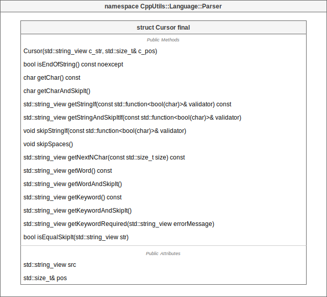

# [CppUtils](../../README.md) / [Language](../README.md) / Parser

[](../README.md)

## Cursor

The ``Cursor`` structure allows you to place a cursor on a string and move it using parsing functions.

It has a multitude of member functions to analyze the string for parsing purposes.

<p align="center"></p>

---

## Expression

The ``Expression.hpp`` file contains all necessary tools to manipulate expressions.

An expression is a syntax element that combines a set of lexemes returning a value.
A lexeme is a lexical unit.

``Token``s are used to name expressions.

There are different types of lexemes. For ease of use, they all inherit the ``ILexeme``.

The different lexemes are:

- ``StringLexeme`` defines a lexeme as a string.

- ``ParserLexeme`` defines a lexeme based on a parsing function.\
The parsing function has the form ``std::function<bool (Parser::Cursor&, TokenNode&)>``. It takes as argument the ``Cursor`` to start reading and the parent node to store the read information.\
The function should return ``false`` if it failed to read what it expected, and ``true`` in the opposite case.

- ``TokenLexeme`` defines a lexeme in the form of a ``Token``. This ``Token`` refers to an ``Expression``.

- ``RecurrentLexeme`` defines a lexeme as a repetition of an ``Expression`` (defined by its ``Token``).\
Depending on the desired number of repetitions, a recurrence type can be defined with the following values: ``Optional``, ``EqualTo``, ``MoreThan`` or ``MoreOrEqualTo``, followed by the number of repetitions.

- ``AlternativeLexeme`` defines a lexeme as varying from one ``Expression`` to another.\
It contains a list of tokens, only one of which will be read depending on the format of the string.

### Example
```cpp
#include <CppUtils.hpp>

int main()
{
	using namespace CppUtils::Type::Literals;

	const stringExpression = CppUtils::Language::Parser::Expression{"string"_token, true};
	stringExpression >> '"' >> CppUtils::Language::Parser::stringParser >> '"';

	for (const auto& lexeme : stringExpression.lexemes)
		std::cout << lexeme.getType() << std::endl;
	
	return 0;
}
```

Result:
```
string
parser
string
```

Several linked expressions can be used to represent a grammar.
The generated grammar can be used by a [lexer](../Lexer/README.md) to analyze a text.

---

## Parsers

Various parsing functions allow you to read specific formats of information, such as quotes, numbers or words.

The parsing functions all have the same signature:
```cpp
bool(Parser::Cursor&, Graph::TokenNode&);
```
The ``Cursor`` represents the character from which to start parsing.
The ``TokenNode`` is the parent node of the [AST](https://en.wikipedia.org/wiki/Abstract_syntax_tree) on which to store the information extracted from the parsed string.
The function returns ``false`` if the text format is incorrect, or ``true`` if everything went well.

### Example
```cpp
#include <CppUtils.hpp>

int main()
{
	using namespace CppUtils::Type::Literals;

	const auto src = "\"Text\""sv;
	auto pos = std::size_t{0};
	auto cursor = CppUtils::Language::Parser::Cursor{src, pos};
	auto root = CppUtils::Language::Graph::TokenNode{"Root"_token};

	if (doubleQuoteParser(cursor, root))
	{
		CppUtils::Terminal::setConsoleOutputUTF8();
		CppUtils::Graph::logTreeNode(root);
	}
	
	return 0;
}
```

Result:
```
 Root
 └─ Text
```
