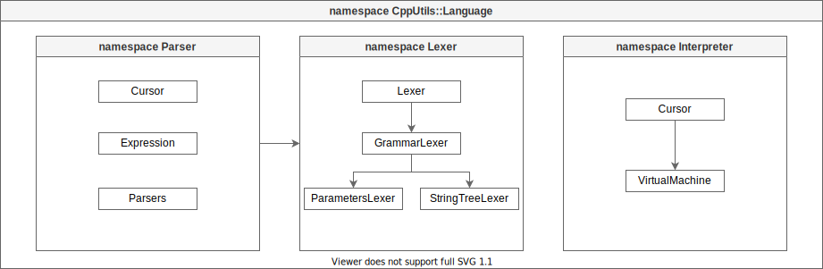

# [CppUtils](../README.md) / Language

The namespace Language provides all the necessary tools for creating, analyzing and executing languages.

## Namespaces
- [Parser](Parser/README.md)
- [Lexer](Lexer/README.md)
- [Interpreter](Interpreter/README.md)
- [Compiler](Compiler/README.md)
- [ASM](ASM/README.md)

---
