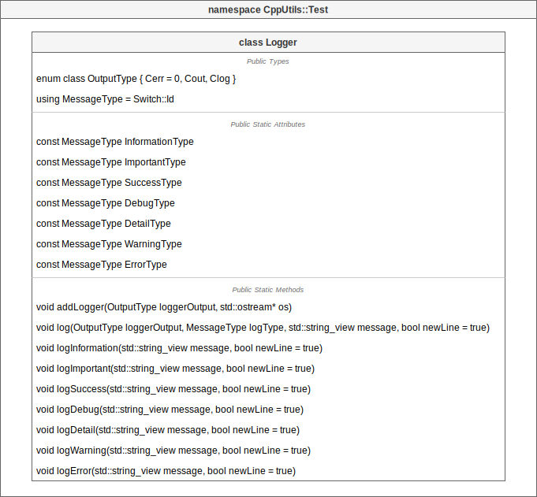
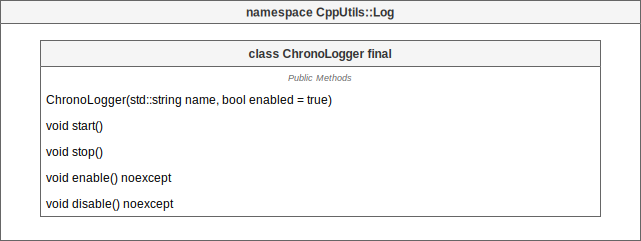

# [CppUtils](../README.md) / Log

[](../README.md)

## Logger

In C++, the ``std::cout``, ``std::cerr`` and ``std::clog`` streams allow to display logs in the terminal.
But writing logs directly into the streams has its limits:
- No color in the terminal
- No activation/deactivation of certain types of logs
- No redirection of logs to another destination (like a log file)

The ``Logger`` class encapsulates these streams by adding these features.

<p align="center"></p>

The ``Logger`` provides a list of log types already defined.
Each log type has its output stream and color.

| Log Type    | Output Stream | Color        |
| ----------- | ------------- | ------------ |
| Information | std::cout     | None (White) |
| Important   | std::cout     | Cyan         |
| Success     | std::cout     | Green        |
| Debug       | std::cout     | Magenta      |
| Detail      | std::cout     | Blue         |
| Warning     | std::cout     | Yellow       |
| Error       | std::cerr     | Red          |

### Example
```cpp
#include <CppUtils.hpp>

int main()
{
	CppUtils::Log::Logger::logInformation("Information message");
	CppUtils::Log::Logger::logImportant("Important message");
	CppUtils::Log::Logger::logSuccess("Success message");
	CppUtils::Log::Logger::logDebug("Debug message");
	CppUtils::Log::Logger::logDetail("Detail message");
	CppUtils::Log::Logger::logWarning("Warning message");
	CppUtils::Log::Logger::logError("Error message");

	return 0;
}
```

---

## ChronoLogger

The ``ChronoLogger`` class is a logger that allows to measure an elapsed time.

The ``ChronoLogger{}`` constructor starts the chronometer automatically.

It automatically writes a log line at each stop of the chronometer.

The logger can be enabled and disabled with the ``enable()`` and ``disable()`` methods.

<p align="center"></p>

### Example
```cpp
#include <CppUtils.hpp>

int main()
{
	using namespace std::chrono_literals;

	auto chronoLogger = CppUtils::Log::ChronoLogger{"Test"};
	std::this_thread::sleep_for(5s);
	chronoLogger.stop();

	return 0;
}
```

---
