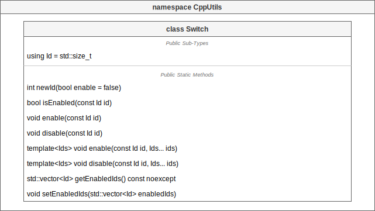

# [CppUtils](../README.md) / Switch

[](../README.md)

## Switch

The ``Switch`` class allows to enable/disable features at the scale of an entire project.
It is equivalent to global boolean variables, but without polluting the namespace with global variables.

<p align="center"></p>

### Example
```cpp
#include <CppUtils.hpp>

int main()
{
	const auto logsSwitch = CppUtils::Switch::newId();

	CppUtils::Switch::enable(logsSwitch);
	if (CppUtils::Switch::isEnabled(logsSwitch))
		std::cout << "Logs Enabled" << std::endl;
	
	CppUtils::Switch::disable(logsSwitch);
	if (CppUtils::Switch::isEnabled(logsSwitch))
		std::cout << "Logs Disabled" << std::endl;
	
	return 0;
}
```

### Result
```
Log Enabled
```

---
