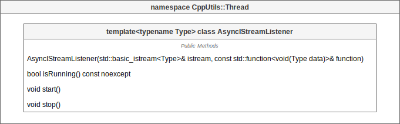
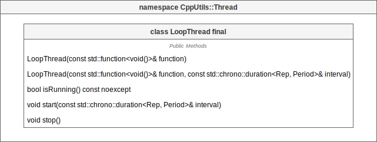

# [CppUtils](../README.md) / Thread

[](../README.md)

## AsyncIStreamListener

The ``AsyncIStreamListener`` class allows to listen to a ``std::istream`` asynchronously.
This feature allows for example to listen to ``std::cin`` without blocking it.

Listening to the ``std::istream`` starts as soon as the ``AsyncIStreamListener`` object is instantiated.
It is possible to interrupt the listener with the ``stop()`` method and resume its execution with ``start()``.

<p align="center"></p>

Example:
```cpp
#include <CppUtils.hpp>

void istreamListener(char c)
{
	std::cout << c;
}

int main()
{
	using namespace std::chrono_literals;

	const auto cinListener = CppUtils::Thread::AsyncIStreamListener{std::cin, &istreamListener};
	std::this_thread::sleep_for(10s);
	return 0;
}
```

---

## LoopThread

The ``LoopThread`` class allows to execute a function in a loop on a separate thread.
The ``LoopThread``s constructor can take an interval that represents a pause between two executions.

<p align="center"></p>

Example:
```cpp
#include <CppUtils.hpp>

void loop()
{
	std::cout << "Spam" << std::endl;
}

int main()
{
	using namespace std::chrono_literals;
	
	const auto loopThread = CppUtils::Thread::LoopThread{&loop, 5s};
	std::this_thread::sleep_for(20s);
	return 0;
}
```

---
