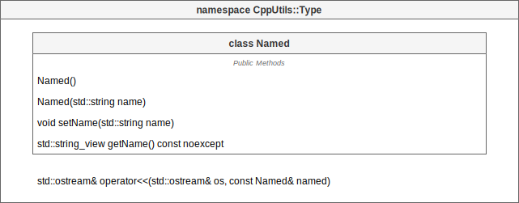

# [CppUtils](../README.md) / Type

[](../README.md)

## Named

The ``Named`` class allows you to assign a name to classes. It is only used by inheriting another class from the ``Named`` class.

<p align="center"></p>

### Example
```cpp
#include <CppUtils.hpp>

class Object: public Named
{
public:
	Object(std::string name): Named{std::move(name)}
	{};
};

int main()
{
	const auto namedObject = Object{"Name"};

	std::cout << namedObject.getName() << std::endl;

	return 0;
}
```

Result:
```
Name
```

---

## Typed

---

## TypeId

---
