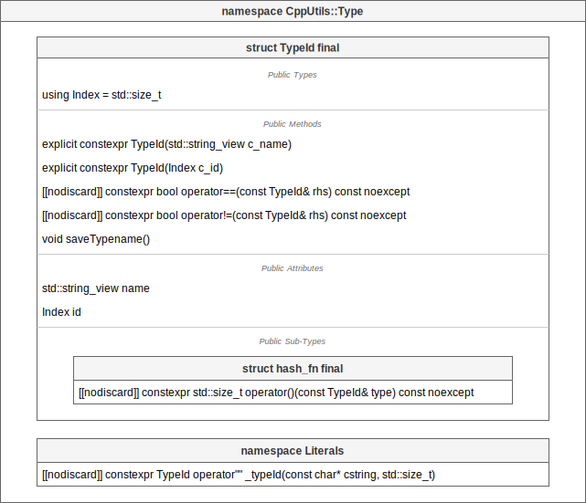

# [CppUtils](../README.md) / Type

[](../README.md)

## Cloneable

The ``ICloneable`` class allows to store instances of different types in the same container.
The stored elements are cloneable with the ``clone()`` method of the ``Cloneable`` class.

<p align="center"></p>

---

## Named

The ``Named`` class allows you to assign a name to classes. It is only used by inheriting another class from the ``Named`` class.

<p align="center"></p>

### Example
```cpp
#include <CppUtils.hpp>

class Object: public Named
{
public:
	Object(std::string name): Named{std::move(name)}
	{};
};

int main()
{
	const auto namedObject = Object{"Name"};

	std::cout << namedObject.getName() << std::endl;

	return 0;
}
```

Result:
```
Name
```

---

## NonCopyable

Types inheriting from the ``NonCopyable`` class will be non-copyable.
The child type must be given as a template of the ``NonCopyable`` class.

<p align="center"></p>

---

## NonInstantiable

Types inheriting from the ``NonInstantiable`` class will be non-instantiable.

<p align="center"></p>

---

## NonMovable

Types inheriting from the ``NonMovable`` class will be non-movable.

<p align="center"></p>

---

## Typed

The ``ITyped`` class allows to store instances of different types in the same container.

The ``getType()`` method of the ``Typed`` struct returns the type of the stored element.
The public attribute ``value`` allows to set and get the stored element.

<p align="center"></p>

### Example
```cpp
#include <CppUtils.hpp>

int main()
{
	using namespace CppUtils::Type::Literals;

	constexpr auto IntType = "Int"_typeId;
	using Int = CppUtils::Type::Typed<IntType, int>;

	constexpr auto StringType = "String"_typeId;
	using String = CppUtils::Type::Typed<StringType, std::string>;

	auto values = std::vector<std::unique_ptr<CppUtils::Type::ITyped>>{};
	values.emplace_back(std::make_unique<Int>(42));
	values.emplace_back(std::make_unique<String>("text"));

	for (const auto& value : values)
	{
		std::cout << value->getType().name << ": ";
		if (value->getType() == IntType)
			std::cout << std::to_string(CppUtils::Type::ensureType<Int>(value).value) << std::endl;
		else if (value->getType() == StringType)
			std::cout << CppUtils::Type::ensureType<String>(value).value << std::endl;
	}

	return 0;
}
```

Result:
```
Int: 42
String: text
```

---

## TypeId

The ``TypeId`` struct allows you to create identifiers from a character string.
These identifiers can be used as key for ``std::map`` or ``std::unordered_map`` to have better performance than with ``std::string`` as key.

<p align="center"></p>

**``TypeId`` is non-owner of the text value**.
To keep the text value after it is unallocated, call the ``saveTypename()`` method of the ``TypeId`` struct.

The ``hash_fn`` struct must be passed to ``std::map`` or ``std::unordered_map`` so that they know how to use ``TypeId`` as a key.

The ``""_typeId`` literal allows you to instantiate TypeId.

### Example
```cpp
#include <CppUtils.hpp>

int main()
{
	using namespace CppUtils::Type::Literals;

	const auto values = std::unordered_map<CppUtils::Type::TypeId, std::string, CppUtils::Type::TypeId::hash_fn>{
		{"Number"_typeId, "42"},
		{"String"_typeId, "text"}
	};

	std::cout << values.at("Number"_typeId) << std::endl;

	return 0;
}
```

Result:
```
42
```

---
