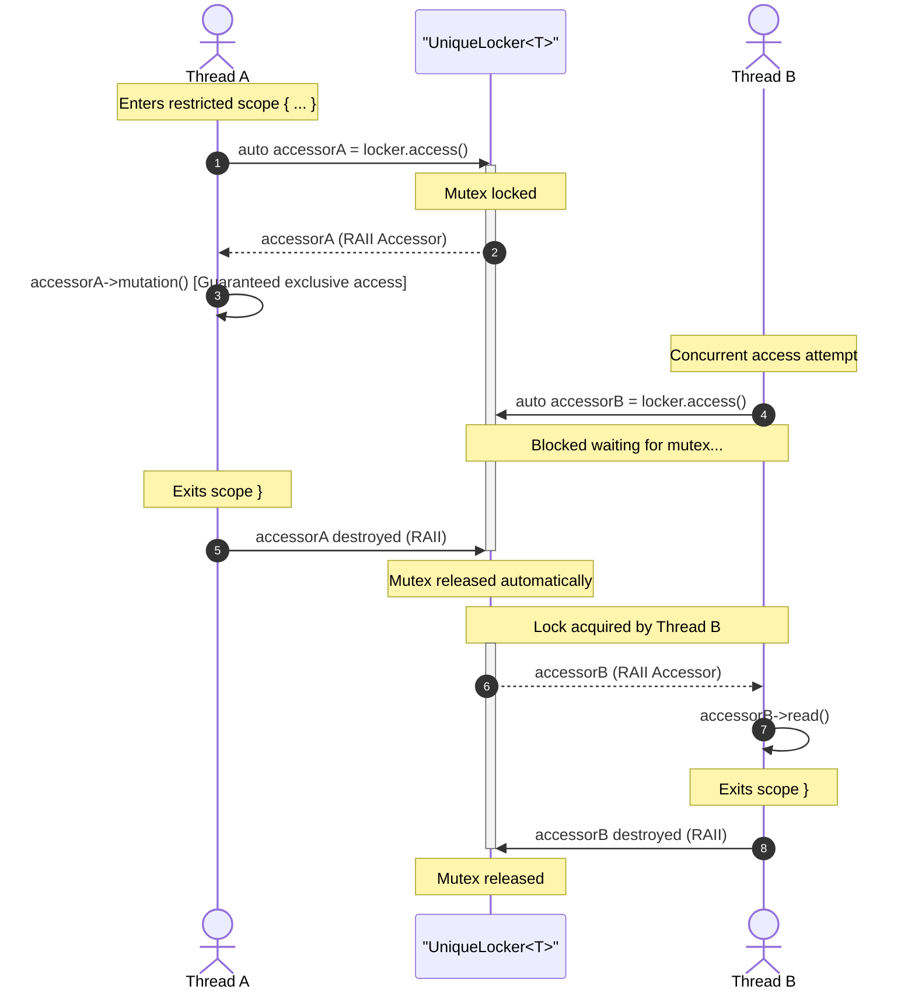
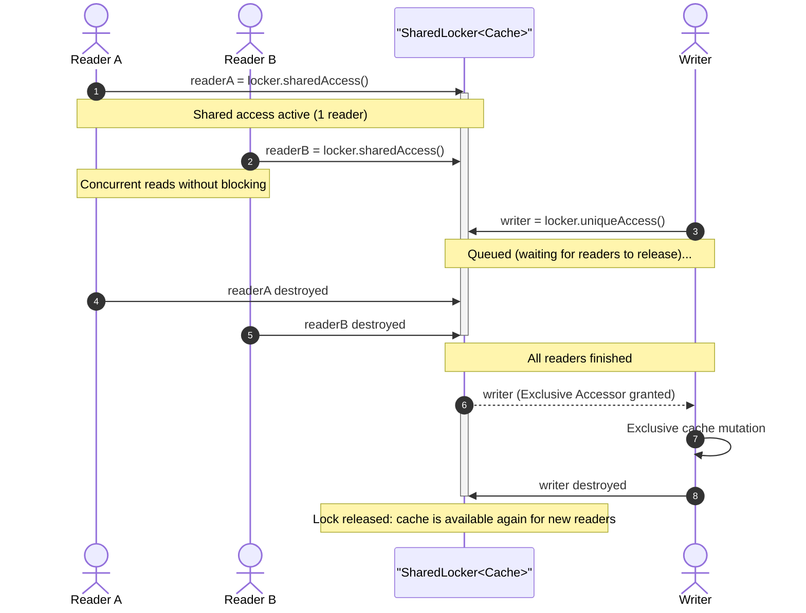
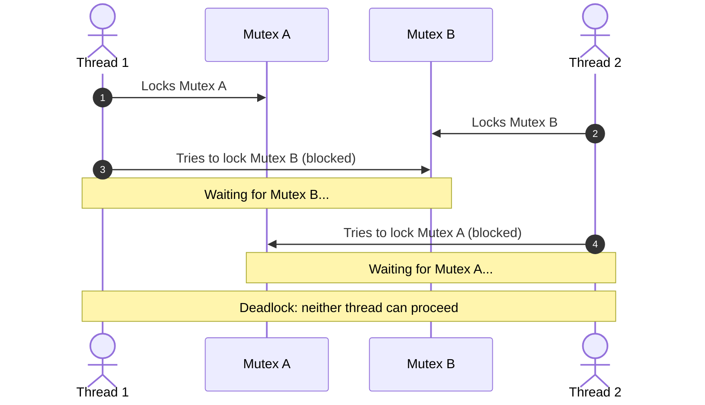

import { Card, CardGrid, Tabs, TabItem, Aside } from '@astrojs/starlight/components';

The `CppUtils::Thread` module resolves concurrency hazards by binding a shared resource and its synchronization lock into a secure container ([`UniqueLocker`](/en/reference/thread/uniquelocker/) or [`SharedLocker`](/en/reference/thread/sharedlocker/)). Accessing the protected value requires creating a temporary RAII guard ([`Accessor`](/en/reference/thread/accessor/) or [`ReadOnlyAccessor`](/en/reference/thread/readonlyaccessor/)), ensuring at compile-time that no read or write operation can happen without holding the appropriate lock.

<CardGrid>
	<Card title="UniqueLocker" icon="seti:lock">
		Exclusive read and write access via [`UniqueLocker`](/en/reference/thread/uniquelocker/) (`std::mutex`). Zero-cost abstraction, recommended default choice for the majority of use cases.
	</Card>
	<Card title="SharedLocker" icon="seti:graphql">
		Shared read and exclusive write access via [`SharedLocker`](/en/reference/thread/sharedlocker/) (`std::shared_mutex`). Designed for caches and shared data structures with frequent concurrent reads across multiple threads and rare mutations.
	</Card>
</CardGrid>

---

## The problem with manual synchronization

In standard C++, protecting shared data relies entirely on developer discipline. The data and the mutex are two separate, disconnected variables:

```cpp showLineNumbers
std::mutex mutex;
std::vector<int> items; // Mutex and data are uncoupled
```

Nothing prevents a thread from accessing `items` directly without locking the mutex. Safety relies entirely on developer vigilance, creating constant cognitive overhead: developers must remember to lock the mutex prior to every access, and when a class contains multiple member variables, determine which lock protects which resource.

### The getter returning reference trap

The most frequent pitfall in object-oriented design is exposing a getter returning a reference:

```cpp showLineNumbers
class DataStore
{
	mutable std::mutex mutex;
	std::vector<int> items;

public:
	auto getItems() const -> const std::vector<int>&
	{
		auto lock = std::lock_guard{mutex};
		return items; // Mutex is unlocked when getItems() returns
	}
};

// Caller:
const auto& reference = store.getItems(); // Error: lock has already been released
// Any subsequent concurrent access causes a data race
```

---

## The solution: Encapsulation with UniqueLocker

With [`UniqueLocker`](/en/reference/thread/uniquelocker/), the protected data is **strictly private** and cannot be reached directly. The only way to interact with it is by instantiating an [`Accessor`](/en/reference/thread/accessor/), which atomically acquires the lock during construction and holds it for its entire lifetime.

:::note[Zero-cost abstraction]
`UniqueLocker` is a **zero-cost abstraction**: its memory size is strictly equal to the sum of its mutex and protected data (`sizeof(UniqueLocker<T>) == sizeof(Mutex) + sizeof(T)`), with no virtual indirection and no heap allocation. When optimizations are enabled, the compiler produces machine code identical to hand-written manual locking using `std::unique_lock`.
:::

```cpp showLineNumbers
class DataStore
{
	CppUtils::Thread::UniqueLocker<std::vector<int>> items;

public:
	auto getItems()
	{
		return items.access(); // Returns an Accessor carrying the active lock
	}
};

// Caller: maintain lock for the entire critical section
{
	auto items = store.getItems();
	items->push_back(42);
	items.value().push_back(43);
	for (int value : items.value())
	{
		// Mutex remains safely locked during the entire loop
	}
} // Mutex is automatically released when items leaves scope
```

### Accessor lifecycle



### Object-level vs member-level locking

One might be tempted to apply `UniqueLocker` individually to each field of a struct:

```cpp showLineNumbers
// Fine-grained approach: each member owns an independent locker
struct BankAccount
{
	CppUtils::Thread::UniqueLocker<int> balance;
	CppUtils::Thread::UniqueLocker<std::vector<std::string>> history;
};
```

Although each member is individually protected, this approach breaks down as soon as multiple operations must be coordinated within a single transaction.

### Atomic compound operations

When multiple logical operations must be executed consecutively, relying on internal locks inside each member introduces two major weaknesses:
1. **Repeated acquisition overhead**: The mutex is locked and unlocked on every individual call.
2. **Broken atomicity (race condition)**: Because the lock is released between two consecutive calls, another thread can intervene and observe an inconsistent intermediate state (e.g. an updated balance without its corresponding history entry).

```cpp showLineNumbers
// Fine-grained synchronization: two distinct locks acquired and released separately
account.balance.access().value() -= 100;
// <-- A concurrent thread can observe the new balance without history here!
account.history.access().value().push_back("Withdrawal of 100");
```

To preserve invariants across multiple fields, two architectural patterns are recommended depending on synchronization ownership:

1. **Internal state structure**: For a self-contained business class, group interdependent members into a private structure protected by an internal `UniqueLocker`. Public methods execute their atomic transaction in a single lock acquisition, while immutable or independent members remain unsynchronized:

```cpp showLineNumbers
class BankAccount
{
	struct State
	{
		int balance = 1000;
		std::vector<std::string> history;
	};

	std::string accountNumber; // Independent: no lock required
	CppUtils::Thread::UniqueLocker<State> state;

public:
	auto withdraw(int amount) -> void
	{
		auto accessor = state.access();
		accessor->balance -= amount;
		accessor->history.push_back(std::format("Withdrawal of {}", amount));
	}
};

// Caller side: straightforward and natural interface, no locks or accessors to manage
auto account = BankAccount{};
account.withdraw(100);
```

2. **Global structure encapsulation**: This approach is ideal for a data aggregate or an existing class that does not natively support multithreading (for example, from a third-party library). Wrapping it in a `UniqueLocker` makes it thread-safe from the outside without modifying its original source code, with the caller coordinating transactions through the accessor:

```cpp showLineNumbers
// Existing business class or struct (not natively synchronized)
struct BankAccount
{
	int balance = 1000;
	std::vector<std::string> history;

	auto withdraw(int amount) -> void
	{
		balance -= amount;
		history.push_back(std::format("Withdrawal of {}", amount));
	}
};

// Caller side: explicit control over lock lifetime
auto account = CppUtils::Thread::UniqueLocker<BankAccount>{};
{
	auto accessor = account.access();
	accessor->withdraw(100);
	// Ability to perform further operations under the same atomic lock
} // Scope exit: single lock release, zero broken atomicity window
```

---

## Shared access with SharedLocker

When an application workload involves numerous threads reading a shared resource simultaneously, the exclusive lock enforced by `UniqueLocker` creates an unnecessary performance bottleneck.

[`SharedLocker`](/en/reference/thread/sharedlocker/) solves this by encapsulating the data with a `std::shared_mutex`. It explicitly distinguishes two access modes:
- **Shared read access** via `.sharedAccess()`, returning a [`ReadOnlyAccessor`](/en/reference/thread/readonlyaccessor/). Multiple reader threads can acquire and hold this accessor concurrently without blocking each other.
- **Exclusive write access** via `.uniqueAccess()`, returning an [`Accessor`](/en/reference/thread/accessor/). The writer waits until all existing readers have released their locks, and no new readers can enter while a mutation is taking place.

### Reader-writer concurrency



### Writer priority and performance trade-offs

Choosing a shared lock requires evaluating your workload characteristics:

- **Writer priority**: To prevent writer starvation, standard library implementations of `std::shared_mutex` stop granting new shared read locks as soon as an exclusive write request is queued. Subsequent readers wait until the writer completes.
- **Shared synchronization overhead**: `std::shared_mutex` is heavier than a standard `std::mutex`. It maintains atomic reader counters and causes CPU cache contention (*cache-line bouncing*). If reader concurrency is low or if read critical sections are very short (a few instructions), `UniqueLocker` will almost always perform better. `SharedLocker` is truly advantageous when **multiple threads read concurrently** across substantial critical sections.

### Multithreaded example with SharedLocker

```cpp showLineNumbers
import std;
import CppUtils;

int main()
{
	auto cache = CppUtils::Thread::SharedLocker<std::map<std::string, int>>{};

	// Writer thread: updates the cache under exclusive lock
	auto writerThread = std::jthread{[&cache] {
		auto writer = cache.uniqueAccess();
		writer.value()["alpha"] = 42;
	}};

	// Concurrent reader threads reading the cache simultaneously without blocking each other
	auto readerThreadA = std::jthread{[&cache] {
		auto reader = cache.sharedAccess();
		if (auto iterator = reader->find("alpha"); iterator != std::ranges::end(reader.value()))
			std::println("Thread A read: {}", iterator->second);
	}};

	auto readerThreadB = std::jthread{[&cache] {
		auto reader = cache.sharedAccess();
		if (auto iterator = reader->find("alpha"); iterator != std::ranges::end(reader.value()))
			std::println("Thread B read: {}", iterator->second);
	}};
}
```

---

## Which Locker to choose?

Choosing between [`UniqueLocker`](/en/reference/thread/uniquelocker/) and [`SharedLocker`](/en/reference/thread/sharedlocker/) depends on concurrent reader volume and mutation frequency.

| Characteristic | [`UniqueLocker<T>`](/en/reference/thread/uniquelocker/) | [`SharedLocker<T>`](/en/reference/thread/sharedlocker/) |
| :--- | :--- | :--- |
| **Underlying Mutex** | `std::mutex` | `std::shared_mutex` |
| **Exclusive access (write)** | `locker.access()` ([`Accessor`](/en/reference/thread/accessor/)) | `locker.uniqueAccess()` ([`Accessor`](/en/reference/thread/accessor/)) |
| **Shared access (read)** | No (always exclusive) | `locker.sharedAccess()` ([`ReadOnlyAccessor`](/en/reference/thread/readonlyaccessor/)) |
| **Acquisition overhead** | Zero-cost abstraction | Higher (atomic reader counters) |
| **Read concurrency** | 1 thread at a time | Unbounded when no writer is pending |
| **Optimal use case** | Frequent writes, simple structures, low thread count | Caches and shared data read frequently across multiple threads and mutated rarely |

---

## Usage pitfalls and safety rules

In C++, temporary objects not bound to a variable are destroyed at the end of the full-expression, which occurs at the semicolon.

<Aside type="caution" title="Temporary accessor lifetime">
Invoking a method directly on a temporary accessor without binding it to a local variable releases the lock immediately at the semicolon terminating the statement.
</Aside>

### Immediate lock release

```cpp showLineNumbers
// The temporary accessor is destroyed at the semicolon
auto size = locker.access()->size();
// The lock is no longer held: the retrieved value might already be outdated
```

### The orphaned reference trap

Holding a reference to the value of a temporary accessor does not prolong the lock:

```cpp showLineNumbers
// Orphaned reference: the accessor is destroyed at the end of the statement
const auto& reference = locker.access().value();

// Error: the mutex is already unlocked
// Any subsequent read or write through 'reference' is unsynchronized
```

### Golden rule: restricted scope

<Aside type="tip" title="Best practice">
Whenever multiple operations must form an atomic transaction, always assign the accessor to a local variable inside a restricted `{ ... }` scope.
</Aside>

```cpp showLineNumbers
// Restricted scope dedicated to the critical section
{
	auto accessor = locker.access();
	accessor->prepare();
	accessor->process();
	accessor->commit();
} // Clean and automatic lock release upon scope exit
```

---

## Multi-resource synchronization (`MultipleAccessor`)

### The deadlock risk

When two threads must acquire multiple locks concurrently in differing orders, inverted acquisition sequences inevitably lead to a deadlock:

<div class="responsive-columns">

```cpp showLineNumbers
// Thread 1
auto lockA = std::lock_guard{mutexA};
auto lockB = std::lock_guard{mutexB}; // Waiting for Mutex B...
```

```cpp showLineNumbers
// Thread 2
auto lockB = std::lock_guard{mutexB};
auto lockA = std::lock_guard{mutexA}; // Waiting for Mutex A...
```

</div>



### Deadlock-free solution with MultipleAccessor

[`MultipleAccessor`](/en/reference/thread/multipleaccessor/) resolves this by leveraging `std::scoped_lock` internally, using a deadlock-avoidance algorithm that guarantees deadlock-free lock acquisition regardless of the order in which lockers are provided:

```cpp showLineNumbers
import std;
import CppUtils;

int main()
{
	auto accountA = CppUtils::Thread::UniqueLocker<BankAccount>{};
	auto accountB = CppUtils::Thread::UniqueLocker<BankAccount>{};

	// Two concurrent threads performing cross-account transfers safely
	auto worker1 = std::jthread{[&] {
		auto lockBoth = CppUtils::Thread::MultipleAccessor{accountA, accountB};
		auto& [firstAccount, secondAccount] = lockBoth.values;
		firstAccount.withdraw(100);
		secondAccount.deposit(100);
	}};

	auto worker2 = std::jthread{[&] {
		// Inverted argument order: guaranteed deadlock-free
		auto lockBoth = CppUtils::Thread::MultipleAccessor{accountB, accountA};
		auto& [secondAccount, firstAccount] = lockBoth.values;
		secondAccount.withdraw(50);
		firstAccount.deposit(50);
	}};
}
```

---

## Summary of best practices

- **Prefer [`UniqueLocker`](/en/reference/thread/uniquelocker/) by default**: Its performance overhead is identical to that of a bare `std::mutex` (zero-cost abstraction). Only choose [`SharedLocker`](/en/reference/thread/sharedlocker/) when several threads perform substantial concurrent reads.
- **Keep critical sections small**: Declare access variables inside the shortest `{ ... }` block possible to minimize contention between threads.
- **Treat the accessor as a safe reference**: An [`Accessor`](/en/reference/thread/accessor/) or [`ReadOnlyAccessor`](/en/reference/thread/readonlyaccessor/) is already a safe, scoped reference. Never attempt to extract the underlying reference to store it past the accessor's lifetime.
- **Use [`MultipleAccessor`](/en/reference/thread/multipleaccessor/) when handling two or more resources**: Avoid nested manual `.access()` calls across lockers to prevent deadlocks.
