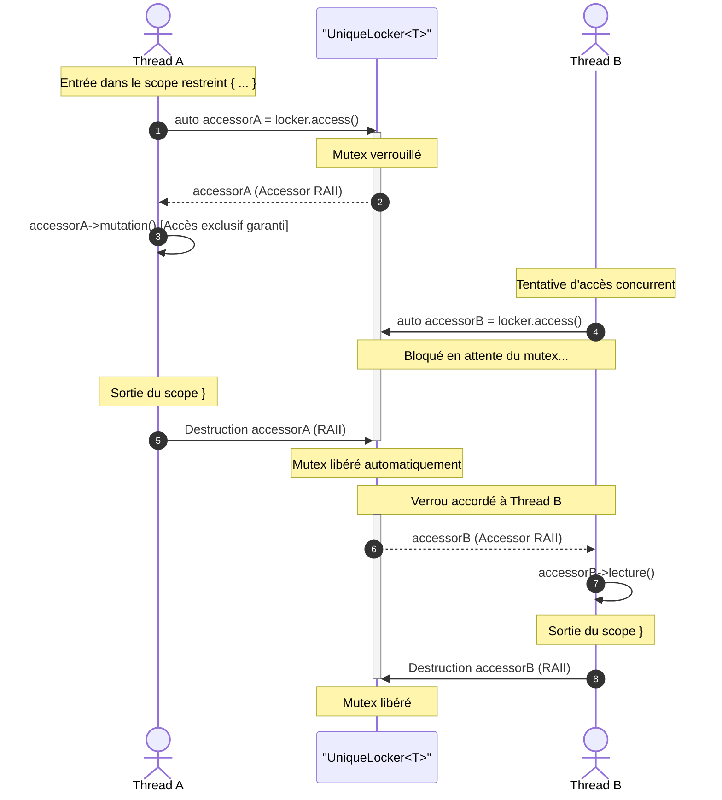
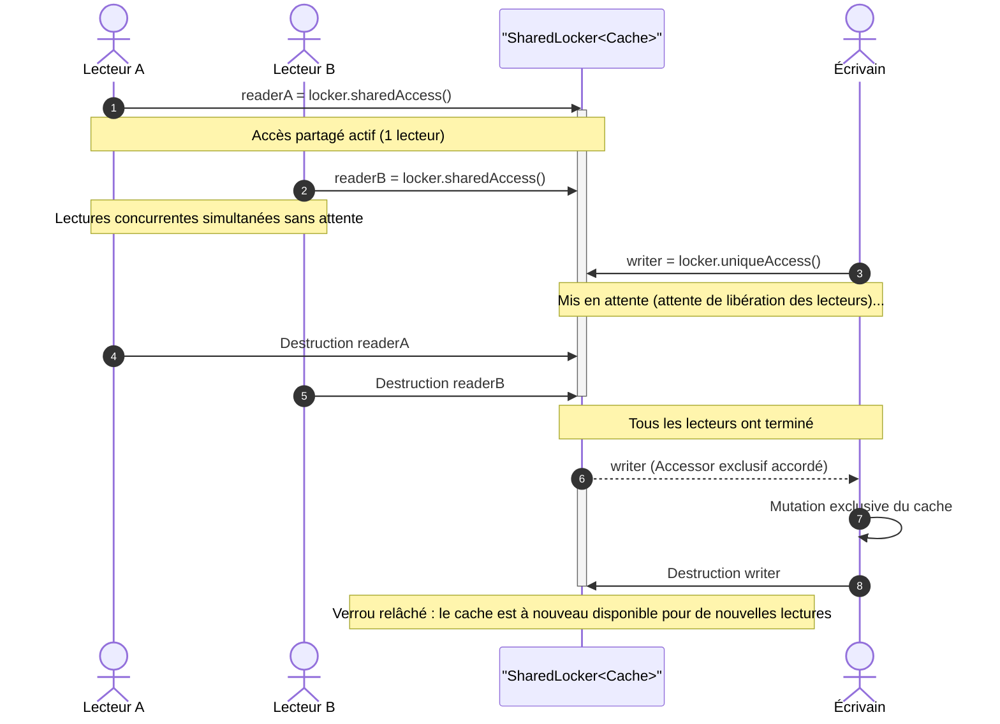
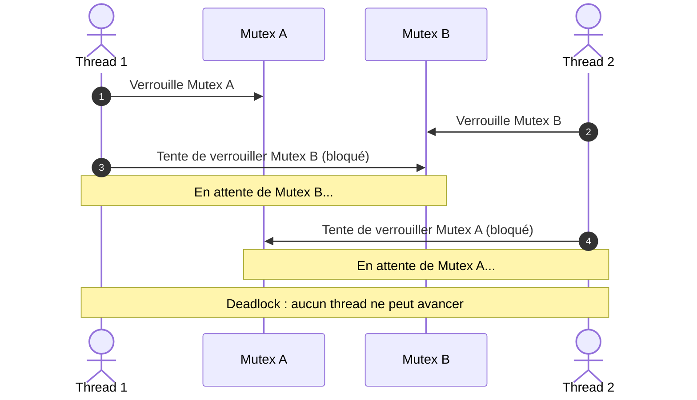

import { Card, CardGrid, Tabs, TabItem, Aside } from '@astrojs/starlight/components';

Le module `CppUtils::Thread` résout les problématiques d'accès concurrent en liant indissociablement toute ressource partagée avec son verrou au sein d'un conteneur sécurisé ([`UniqueLocker`](/fr/reference/thread/uniquelocker/) ou [`SharedLocker`](/fr/reference/thread/sharedlocker/)). L'accès à la donnée sous-jacente est conditionné par l'instanciation d'un objet RAII temporaire ([`Accessor`](/fr/reference/thread/accessor/) ou [`ReadOnlyAccessor`](/fr/reference/thread/readonlyaccessor/)), garantissant à la compilation qu'aucune lecture ni écriture ne peut survenir sans détenir le verrou adéquat.

<CardGrid>
	<Card title="UniqueLocker" icon="seti:lock">
		Accès exclusif en lecture et écriture via [`UniqueLocker`](/fr/reference/thread/uniquelocker/) (`std::mutex`). Zero-cost abstraction, choix recommandé par défaut pour la majorité des cas d'usage.
	</Card>
	<Card title="SharedLocker" icon="seti:graphql">
		Accès partagé en lecture et exclusif en écriture via [`SharedLocker`](/fr/reference/thread/sharedlocker/) (`std::shared_mutex`). Conçu pour les caches et données partagées à lectures concurrentes fréquentes par plusieurs threads et écritures rares.
	</Card>
</CardGrid>

---

## Le problème de la synchronisation manuelle

En C++ standard, la protection d'une donnée partagée repose uniquement sur la discipline du développeur. La donnée et le mutex sont deux variables indépendantes et décorrélées :

```cpp showLineNumbers
std::mutex mutex;
std::vector<int> items; // Le mutex et la donnée sont décorrélés
```

Rien n'interdit à un thread d'accéder directement à `items` sans verrouiller le mutex. La sécurité repose intégralement sur la vigilance du développeur, ce qui engendre une charge mentale permanente : ne jamais oublier de verrouiller le mutex avant chaque accès, et en présence de multiples variables membres, déterminer avec précision quel verrou protège quelle ressource.

### Le piège du getter retournant une référence

L'erreur la plus fréquente en programmation orientée objet consiste à concevoir un getter renvoyant une référence :

```cpp showLineNumbers
class DataStore
{
	mutable std::mutex mutex;
	std::vector<int> items;

public:
	auto getItems() const -> const std::vector<int>&
	{
		auto lock = std::lock_guard{mutex};
		return items; // Le mutex est déverrouillé dès la fin de l'appel
	}
};

// Côté appelant :
const auto& reference = store.getItems(); // Erreur : le verrou a déjà été libéré
// Tout accès concurrent ultérieur constitue une data race
```

---

## La solution : Encapsulation avec UniqueLocker

Avec [`UniqueLocker`](/fr/reference/thread/uniquelocker/), la donnée protégée est **strictement privée** et inaccessible directement. L'unique moyen d'interagir avec elle est d'instancier un [`Accessor`](/fr/reference/thread/accessor/), qui acquiert le verrou de manière atomique à sa construction et le conserve durant toute sa durée de vie.

:::note[Zero-cost abstraction]
`UniqueLocker` est une **zero-cost abstraction** : sa taille mémoire est strictement égale à la somme de son mutex et de la donnée protégée (`sizeof(UniqueLocker<T>) == sizeof(Mutex) + sizeof(T)`), sans indirection virtuelle ni allocation dynamique. À l'optimisation, le compilateur produit un code machine rigoureusement identique à un verrouillage manuel par `std::unique_lock`.
:::

```cpp showLineNumbers
class DataStore
{
	CppUtils::Thread::UniqueLocker<std::vector<int>> items;

public:
	auto getItems()
	{
		return items.access(); // Retourne un Accessor transportant le verrou actif
	}
};

// Côté appelant : maintien du verrou pendant toute la section critique
{
	auto items = store.getItems();
	items->push_back(42);
	items.value().push_back(43);
	for (int value : items.value())
	{
		// Le mutex demeure verrouillé pendant toute la durée de la boucle
	}
} // Le mutex est automatiquement libéré à la destruction de items
```

### Cycle de vie d'un Accessor



### Verrouillage global vs verrouillage par membre

On pourrait être tenté d'appliquer `UniqueLocker` individuellement à chaque champ d'une structure :

```cpp showLineNumbers
// Approche granulaire : chaque champ possède son propre locker indépendant
struct BankAccount
{
	CppUtils::Thread::UniqueLocker<int> balance;
	CppUtils::Thread::UniqueLocker<std::vector<std::string>> history;
};
```

Bien que chaque variable soit protégée isolément, cette approche soulève un problème dès que plusieurs opérations doivent être coordonnées au sein d'une même transaction.

### Opérations composées insécables

Lorsque plusieurs opérations logiques doivent être exécutées à la suite, confier la synchronisation à des verrous internes propres à chaque membre présente deux faiblesses majeures :
1. **Surcoût d'acquisition répété** : le mutex est verrouillé puis déverrouillé à chaque appel successif.
2. **Rupture d'atomicité (race condition)** : le verrou étant relâché entre deux appels consécutifs, un thread concurrent peut s'intercaler et observer un état transitoire corrompu (par exemple, un solde débité sans son entrée correspondante dans l'historique).

```cpp showLineNumbers
// Synchronisation granulaire : deux verrous distincts acquis et relâchés séparément
account.balance.access().value() -= 100;
// <-- Un thread concurrent peut observer le solde sans son historique ici !
account.history.access().value().push_back("Retrait de 100");
```

Pour préserver les invariants entre plusieurs champs, deux architectures sont recommandées selon la responsabilité de la synchronisation :

1. **Structure interne d'état** : Pour une classe métier autonome, regroupez les membres interdépendants dans une structure privée protégée par un `UniqueLocker`. Les méthodes publiques exécutent leur transaction atomique en une seule acquisition, tandis que les membres immuables ou indépendants restent non synchronisés :

```cpp showLineNumbers
class BankAccount
{
	struct State
	{
		int balance = 1000;
		std::vector<std::string> history;
	};

	std::string accountNumber; // Indépendant : aucun verrou requis
	CppUtils::Thread::UniqueLocker<State> state;

public:
	auto withdraw(int amount) -> void
	{
		auto accessor = state.access();
		accessor->balance -= amount;
		accessor->history.push_back(std::format("Retrait de {}", amount));
	}
};

// Côté appelant : interface simple et directe, aucun verrou ni accessor à manipuler
auto account = BankAccount{};
account.withdraw(100);
```

2. **Encapsulation de la structure globale** : Cette approche est idéale pour un agrégat de données ou une classe existante qui ne supporte pas nativement le multithreading (par exemple issue d'une bibliothèque tierce). L'encapsulation dans un `UniqueLocker` sécurise son utilisation depuis l'extérieur sans altérer son code source, l'appelant coordonnant les transactions via l'accessor :

```cpp showLineNumbers
// Classe ou structure métier existante (non synchronisée nativement)
struct BankAccount
{
	int balance = 1000;
	std::vector<std::string> history;

	auto withdraw(int amount) -> void
	{
		balance -= amount;
		history.push_back(std::format("Retrait de {}", amount));
	}
};

// Côté appelant : gestion explicite du cycle de vie du verrou
auto account = CppUtils::Thread::UniqueLocker<BankAccount>{};
{
	auto accessor = account.access();
	accessor->withdraw(100);
	// Possibilité d'enchaîner d'autres opérations sous le même verrou
} // Sortie de scope : libération unique du verrou, aucune rupture d'atomicité
```

---

## Accès partagé avec SharedLocker

Lorsque la charge d'un programme comporte de nombreux threads accédant simultanément à une même ressource en lecture seule, l'accès exclusif imposé par `UniqueLocker` devient un goulet d'étranglement inutile.

[`SharedLocker`](/fr/reference/thread/sharedlocker/) résout ce problème en encapsulant la donnée avec un `std::shared_mutex`. Il sépare explicitement deux modes d'accès :
- **Accès partagé en lecture** via `.sharedAccess()`, qui instancie un [`ReadOnlyAccessor`](/fr/reference/thread/readonlyaccessor/). Plusieurs threads lecteurs peuvent acquérir et détenir un tel accesseur en même temps sans se bloquer mutuellement.
- **Accès exclusif en écriture** via `.uniqueAccess()`, qui instancie un [`Accessor`](/fr/reference/thread/accessor/). L'écrivain attend que tous les lecteurs aient libéré leur verrou, et aucun nouveau lecteur ne peut entrer pendant la modification.

### Concurrence lecteurs-écrivain



### Priorité aux écrivains et compromis de performance

Le choix d'un verrou partagé doit être motivé par une analyse attentive :

- **Priorité aux écrivains** : Pour prévenir la famine des écrivains (*writer starvation*), la majorité des implémentations de la bibliothèque standard (`std::shared_mutex`) cessent d'accorder de nouveaux verrous partagés dès qu'une demande d'écriture exclusive est en attente. Les lecteurs suivants sont mis en pause jusqu'à ce que l'écrivain ait terminé.
- **Le coût de la synchronisation partagée** : `std::shared_mutex` est plus lourd qu'un simple `std::mutex`. Il manipule des compteurs atomiques complexes et génère de la contention sur les lignes de cache processeur (*cache-line bouncing*). Si le nombre de threads lecteurs est faible ou si la lecture est très rapide (quelques instructions), `UniqueLocker` sera presque toujours plus rapide. `SharedLocker` devient réellement avantageux lorsque **plusieurs threads lisent simultanément** au sein de sections critiques d'une durée significative.

### Exemple multithreadé avec SharedLocker

```cpp showLineNumbers
import std;
import CppUtils;

int main()
{
	auto cache = CppUtils::Thread::SharedLocker<std::map<std::string, int>>{};

	// Thread écrivain : met à jour le cache sous verrou exclusif
	auto writerThread = std::jthread{[&cache] {
		auto writer = cache.uniqueAccess();
		writer.value()["alpha"] = 42;
	}};

	// Deux threads lecteurs concurrents lisant le cache simultanément sans se bloquer
	auto readerThreadA = std::jthread{[&cache] {
		auto reader = cache.sharedAccess();
		if (auto iterator = reader->find("alpha"); iterator != std::ranges::end(reader.value()))
			std::println("Thread A a lu : {}", iterator->second);
	}};

	auto readerThreadB = std::jthread{[&cache] {
		auto reader = cache.sharedAccess();
		if (auto iterator = reader->find("alpha"); iterator != std::ranges::end(reader.value()))
			std::println("Thread B a lu : {}", iterator->second);
	}};
}
```

---

## Quel Locker choisir ?

Le choix entre [`UniqueLocker`](/fr/reference/thread/uniquelocker/) et [`SharedLocker`](/fr/reference/thread/sharedlocker/) dépend du nombre de threads concurrents en lecture et de la fréquence des mutations.

| Caractéristique | [`UniqueLocker<T>`](/fr/reference/thread/uniquelocker/) | [`SharedLocker<T>`](/fr/reference/thread/sharedlocker/) |
| :--- | :--- | :--- |
| **Mutex sous-jacent** | `std::mutex` | `std::shared_mutex` |
| **Accès exclusif (écriture)** | `locker.access()` ([`Accessor`](/fr/reference/thread/accessor/)) | `locker.uniqueAccess()` ([`Accessor`](/fr/reference/thread/accessor/)) |
| **Accès partagé (lecture)** | Non (toujours exclusif) | `locker.sharedAccess()` ([`ReadOnlyAccessor`](/fr/reference/thread/readonlyaccessor/)) |
| **Surcoût d'acquisition** | Zero-cost abstraction | Plus élevé (compteurs atomiques de lecteurs) |
| **Concurrence en lecture** | 1 seul thread à la fois | Illimitée en l'absence d'écrivain |
| **Cas d'usage optimal** | Écritures fréquentes, structures simples, peu de threads | Caches et données partagées lues fréquemment par plusieurs threads et mutées rarement |

---

## Pièges d'utilisation et règles de sécurité

En C++, les objets temporaires non affectés à une variable sont détruits immédiatement à la fin de l'expression complète, c'est-à-dire dès le point-virgule.

<Aside type="caution" title="Durée de vie des accesseurs temporaires">
Invoquer une méthode directement sur un accesseur temporaire sans l'assigner à une variable locale libère le verrou dès le point-virgule terminant l'instruction.
</Aside>

### Perte immédiate du verrou

```cpp showLineNumbers
// L'accesseur temporaire est détruit dès le point-virgule
auto size = locker.access()->size();
// Le verrou n'est plus actif : la valeur lue peut déjà être caduque
```

### Le piège de la référence orpheline

Conserver une référence sur la valeur d'un accesseur temporaire ne prolonge pas la durée de vie du verrou sous-jacent :

```cpp showLineNumbers
// Référence orpheline : l'accesseur est détruit à la fin de l'instruction
const auto& reference = locker.access().value();

// Erreur : le mutex est déjà déverrouillé
// Toute lecture ou modification via 'reference' n'est plus synchronisée
```

### Règle d'or : le scope restreint

<Aside type="tip" title="Bonne pratique">
Pour garantir qu'un verrou demeure actif sur toute une séquence d'opérations, assignez systématiquement l'accesseur à une variable locale au sein d'un scope `{ ... }`.
</Aside>

```cpp showLineNumbers
// Scope dédié à la section critique
{
	auto accessor = locker.access();
	accessor->prepare();
	accessor->process();
	accessor->commit();
} // Libération propre et automatique du mutex en fin de scope
```

---

## Synchronisation multi-ressources (`MultipleAccessor`)

### Le risque de deadlock

Lorsque deux threads doivent acquérir plusieurs verrous simultanément dans un ordre différent, une inversion dans les séquences d'acquisition conduit inévitablement à un deadlock :

<div class="responsive-columns">

```cpp showLineNumbers
// Thread 1
auto lockA = std::lock_guard{mutexA};
auto lockB = std::lock_guard{mutexB}; // Attend Mutex B...
```

```cpp showLineNumbers
// Thread 2
auto lockB = std::lock_guard{mutexB};
auto lockA = std::lock_guard{mutexA}; // Attend Mutex A...
```

</div>



### La solution avec MultipleAccessor

[`MultipleAccessor`](/fr/reference/thread/multipleaccessor/) résout ce risque en s'appuyant en interne sur `std::scoped_lock`, qui utilise un algorithme d'acquisition ordonnée garantissant l'absence de deadlock, quel que soit l'ordre dans lequel les lockers lui sont passés :

```cpp showLineNumbers
import std;
import CppUtils;

int main()
{
	auto accountA = CppUtils::Thread::UniqueLocker<BankAccount>{};
	auto accountB = CppUtils::Thread::UniqueLocker<BankAccount>{};

	// Deux threads effectuant des transferts croisés simultanés sans deadlock
	auto worker1 = std::jthread{[&] {
		auto lockBoth = CppUtils::Thread::MultipleAccessor{accountA, accountB};
		auto& [firstAccount, secondAccount] = lockBoth.values;
		firstAccount.withdraw(100);
		secondAccount.deposit(100);
	}};

	auto worker2 = std::jthread{[&] {
		// Ordre inversé des arguments : aucun risque de deadlock
		auto lockBoth = CppUtils::Thread::MultipleAccessor{accountB, accountA};
		auto& [secondAccount, firstAccount] = lockBoth.values;
		secondAccount.withdraw(50);
		firstAccount.deposit(50);
	}};
}
```

---

## Synthèse des bonnes pratiques

- **Privilégiez [`UniqueLocker`](/fr/reference/thread/uniquelocker/) par défaut** : son coût est strictement identique à celui d'un simple `std::mutex` (zero-cost abstraction). N'adoptez [`SharedLocker`](/fr/reference/thread/sharedlocker/) que lorsque plusieurs threads effectuent des lectures concurrentes fréquentes.
- **Isolez vos sections critiques** : déclarez vos variables d'accès dans un bloc d'instructions `{ ... }` restreint pour limiter la contention entre threads.
- **Considérez l'accessor comme une référence sûre** : un [`Accessor`](/fr/reference/thread/accessor/) ou [`ReadOnlyAccessor`](/fr/reference/thread/readonlyaccessor/) constitue déjà une référence sécurisée. Ne cherchez jamais à en extraire la référence sous-jacente pour l'utiliser en dehors de sa portée.
- **Utilisez [`MultipleAccessor`](/fr/reference/thread/multipleaccessor/) dès deux ressources** : évitez d'imbriquer des appels consécutifs à `.access()` sur des lockers distincts afin de garantir l'absence de deadlock.
